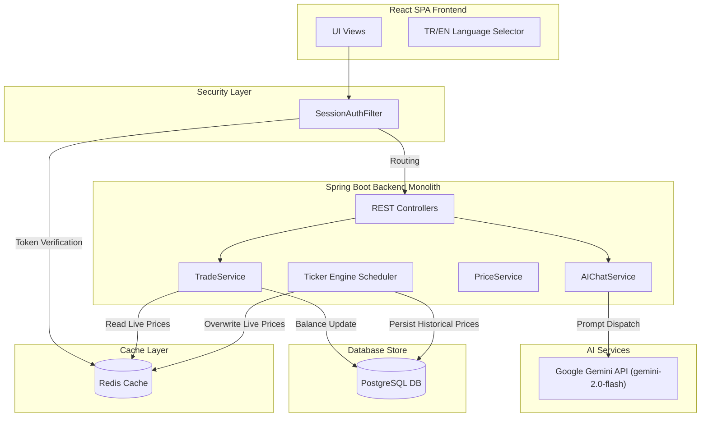

# ZyptoX (CryptoPal) - Next-Gen Simulated Crypto Trading Platform

ZyptoX (referred to as CryptoPal in academic and training documentations) is a high-performance, low-latency, simulated cryptocurrency trading application. It bridges the gap between raw real-time market data and intelligent, actionable financial insights for end-users. 

The application is engineered as a decoupled modular architecture consisting of a React Single-Page Application (SPA) frontend, a Spring Boot monolithic backend, a PostgreSQL relational store, and a Redis caching layer for sub-millisecond session validation and live price caching.

---

## System Architecture

The following diagram illustrates the data flow and architectural interactions across the ZyptoX ecosystem (React UI, security filters, Spring Boot services, Redis cache, PostgreSQL DB, and the Gemini AI API):



---

## Project Structure

The codebase is organized into the following main directories:

```
├── zyptox-backend/      # Spring Boot monolithic backend application
├── zyptox-frontend/     # React TypeScript frontend SPA application
├── zyptox-db/           # Database configurations and initialization DDL scripts
├── docker-compose.yaml  # Multi-container orchestration (PostgreSQL & Redis)
├── SOLUTION.md          # Project report and screenshots configuration
└── README.md            # Project overview and developer setup guide
```

---

## Key Features

- **Real-Time Market Tracking**: Automated background price simulation engine (Ticker Engine) fluctuating coin prices every 15 seconds.
- **Simulated Trading Desk**: Enforces strict transactional integrity (ACID) during simulated BUY and SELL orders, updating user cash and crypto wallet allocations.
- **AI Financial Assistant**: Integrated with Google Gemini (gemini-2.0-flash) providing real-time portfolio analysis, trade history reviews, and individual coin technical charts.
- **Robust Offline Fallback**: Custom-engineered exception-shielded fallback system that serves localized reports in Turkish or English if the Gemini API reaches rate limits or is offline.
- **Preserved Language Toggling**: Fully localized TR/EN language switcher using React Context, specifically designed to preserve active input states, selected assets, and conversation history across language swaps.

---

## Technology Stack

- **Frontend**: React (TypeScript, Vite, Vanilla CSS)
- **Backend**: Spring Boot 3.x (Java 17+, Hibernate JPA, Spring Security)
- **Cache & Authentication**: Redis (Volatile sessions & live prices)
- **Database**: PostgreSQL (User accounts, balances, transactions, and historical price charts)
- **Containerization**: Docker & Docker Compose

---

## Environment Configurations

Create a `.env` file in the root directory with the following variables:

```env
DB_NAME=ZyptoX
DB_USER=ZyptoX_user
DB_PASSWORD=ZyptoX_pass
DB_PORT=5433
GEMINI_API_KEY=your_gemini_api_key_here
```

To use the live Gemini AI assistant, ensure you create a developer API key directly via Google AI Studio (keys starting with AIzaSy). Keys generated in the standard Google Cloud Platform Console default to 0 requests/min on the free tier and will cause the assistant to operate in offline fallback mode.

---

## Getting Started

### 1. Start Databases (Docker Compose)
Provision the PostgreSQL and Redis containers from the root directory:
```bash
docker compose up -d
```

### 2. Run the Backend (PowerShell)
To set environment variables and start the Spring Boot server from the `zyptox-backend` directory, execute:
```powershell
if (Test-Path ..\.env) { Get-Content ..\.env | ForEach-Object { if ($_ -match "^\s*([^#=\s]+)\s*=\s*(.*)\s*$") { $name = $Matches[1]; $val = $Matches[2].Trim(); [System.Environment]::SetEnvironmentVariable($name, $val, "Process") } } }; ./mvnw spring-boot:run
```

### 3. Run the Frontend (Vite)
Navigate to the `zyptox-frontend` directory, install dependencies, and launch the development server:
```bash
npm install
npm run dev
```

---

## Contributors and Roles

- **Zeynep Kızılkaya**: Backend Architecture & Google Gemini AI Integration. [GitHub Profile](https://github.com/zeynepkizilkaya)
- **Efe Koç**: Frontend SPA & UI/UX Development. [GitHub Profile](https://github.com/efekoc)
- **Zeynep Sıla Durak**: PostgreSQL/Redis Database Schema & Docker Containerization. [GitHub Profile](https://github.com/zeynepsldrk)
